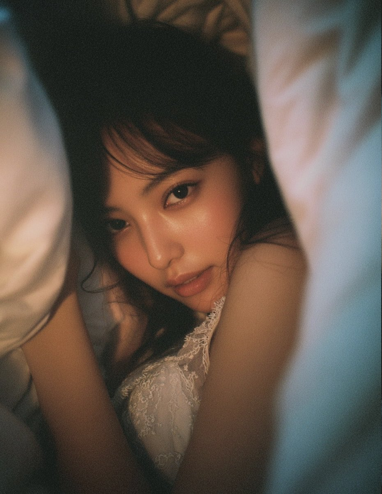
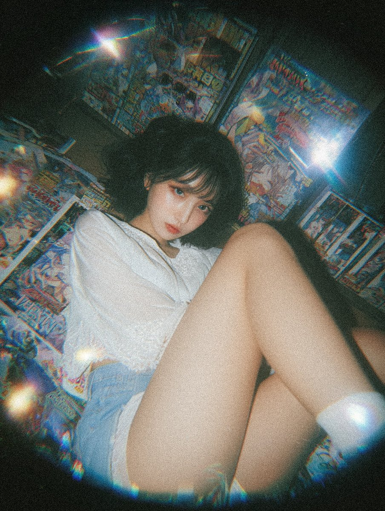

# Awesome-Images-Prompts
适用于 Gemini Nano-banana Image、即梦、豆包 Seedream 4.0、Hunyuan 3.0、ChatGPT-4o、Grok Image、FLUX、Ideogram、Imagen、Leonardo Ai、Midjourney 等AI生图大模型的提示词

|        | Nano-banana | 即梦 | 豆包 Seedream 4.0 | Hunyuan 3.0 |
| ------ | ----------- | ---- | ----------------- | ----------- |
| 文生图 | ✅           | ✅    | ✅                 | ✅           |
| 图生图 | ✅           | ✅    | ✅                 | ❌           |

## 免费领取一个月 Perplexity Pro 会员

1. 下载 [Comet浏览器](https://pplx.ai/cxxh888)
2. 登录 Comet 并提问一个问题
3. Windows 安装 [Comet浏览器](https://pplx.ai/cxxh888) 卡在“等待网络”的界面解决方案：[点击直达解决方案](https://www.wangdu.site/software/ai/2276.html)

## AI生图提示词使用教程

1. [⁤‌‍⁤‌⁢⁣‌‍‬⁢⁤⁡⁤⁡‌⁢‬⁣‬‌‌⁣‍‍‌‌⁤⁣‌⁣‍⁢⁡⁢⁣⁡‌‌豆包 Seedream 4.0 使用指南 - 飞书云文档](https://bytedance.larkoffice.com/docx/XwngdqdhIowfF8xhEA4cwpS2nLb)

## AI生图提示词仓库

### Gemini Nano-banana

1. [ZHO-ZHO-ZHO/ZHO-nano-banana-Creation](https://github.com/ZHO-ZHO-ZHO/ZHO-nano-banana-Creation/tree/main)：nano-banana 创意玩法大合集！
2. [PicoTrex/Awesome-Nano-Banana-images](https://github.com/PicoTrex/Awesome-Nano-Banana-images/)：收集了Nano-banana在各个任务场景下生成的令人惊艳的图片和提示词，全方位展示Google在图像生成与编辑的无限可能。希望能帮助你更好地了解 Nano-banana。快一起解锁 Nano-banana 的多图融合与创意编辑力量吧！

### GPT-4o

1. [jamez-bondos/awesome-gpt4o-images](https://github.com/jamez-bondos/awesome-gpt4o-images)：一个精选的 GPT-4o 与 gpt-image-1 生成图像与提示词合集。借助 ChatGPT 和 Sora，全面展示 OpenAI 在 AI 图像生成方面的前沿能力，并不断探索创意表达的新可能。

## AI生图提示词展示案例

### Adult Coloring Book Pages（成人填色书页）

#### Cute Halloween Coloring Pages

English Prompt：

```markdown
a black and white coloring page of [insert Halloween scene], black pen outlines, white background, charming, lovable, minimalistic vector line drawing, flat output --no color --ar 49:64 --s 47 --v 5.2 --q 1
```

### 日系朦胧感美女

[作者原贴](https://x.com/MANISH1027512/status/1978041705623343437)

English Prompt：

```markdown
a dreamy intimate portrait of a beautiful realistic asian woman lying under a blanket, soft natural light, cozy warm bedroom, cinematic film grain, 35mm film aesthetic, shallow depth of field, soft focus, delicate skin texture, natural makeup, slightly messy hair, Fujifilm Pro 400H look, pastel warm tones, realistic lighting, subtle haze, gentle atmosphere, by Petra Collins and Ren Hang --ar 3:4 --v7 --style raw
```



###  梦幻般美女胶片照片

[作者原贴](https://x.com/MANISH1027512/status/1981332633444339960)

English Prompt：

```
a dreamy top-down film photograph of a young beautiful East Asian woman lying on the floor surrounded by colorful anime magazines; relaxed gaze at camera, soft lips slightly parted; short fluffy dark hair with bangs; wearing a loose white short-sleeve blouse with lace trim and pale shorts, natural makeup with soft pink lips and subtle blush precise leg pose: pelvis slightly rotated toward camera; the near leg lifted and bent at the knee about 120 degrees, thigh pointing toward the camera with strong foreshortening, calf directed toward the bottom edge, ankle gently plantar-flexed, semi-transparent ankle sock visible; the far leg extended diagonally outward captured with a fisheye lens, producing ultra-wide barrel distortion, curved perspective lines, and central magnification; edges softly blurred with a dark circular vignette, creating a tunnel vision effect and nostalgic dreamy mood rainbow reflections from glossy magazines, warm ambient lighting, analog film grain texture, Japanese retro aesthetic
```

中文提示词：

```
一张梦幻般的自上而下胶片照片，照片中一位年轻美丽的东亚女性躺在地板上，周围是色彩缤纷的动漫杂志；她放松地注视着镜头，柔软的嘴唇微微张开；蓬松的深色短发，有刘海；她身穿宽松的白色短袖衬衫，饰有蕾丝花边，配以浅色短裤，化着自然妆容，嘴唇上涂着柔和的粉红色，并带有淡淡的腮红；精确的腿部姿势：骨盆略微向镜头旋转；近腿抬起，膝盖弯曲约 120 度，大腿指向镜头，透视感很强，小腿朝向底部边缘，脚踝轻轻跖屈，半透明的踝袜清晰可见；远处的腿向外斜伸展，用鱼眼镜头拍摄，产生超广角桶形失真、弯曲的透视线和中心放大；边缘用深色圆形晕影柔和模糊，营造出隧道视觉效果和怀旧梦幻般的氛围，光泽杂志的彩虹反射，温暖的环境照明，模拟胶片颗粒纹理，日本复古美学
```


