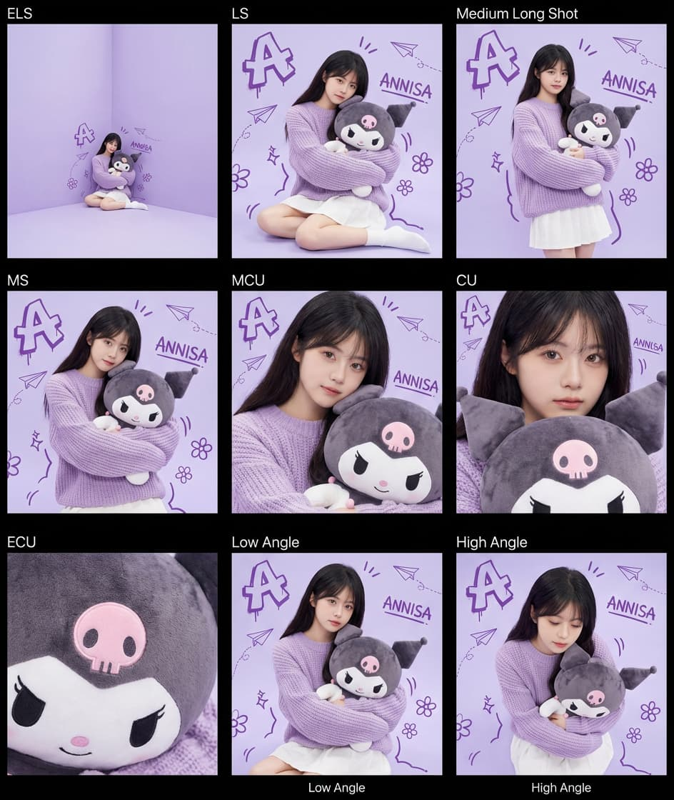
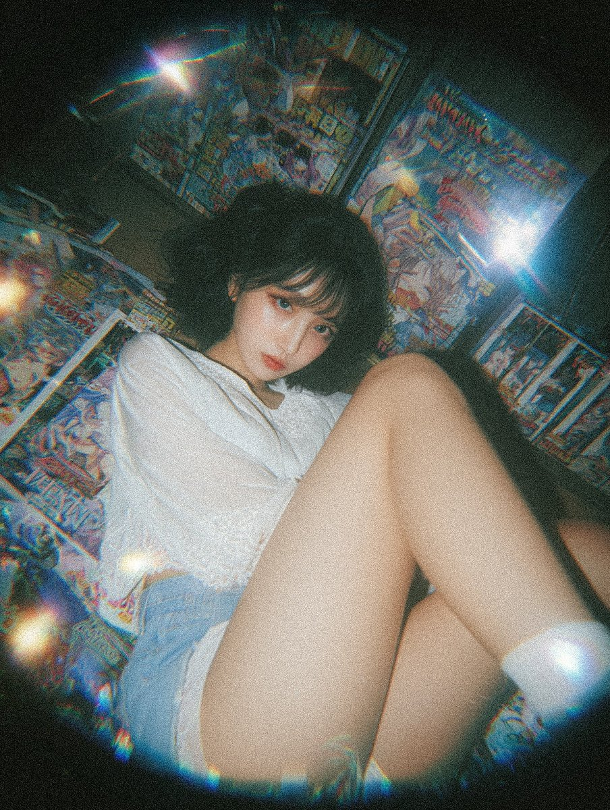
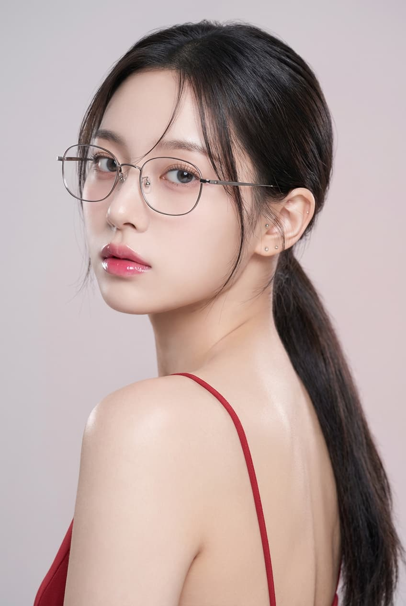
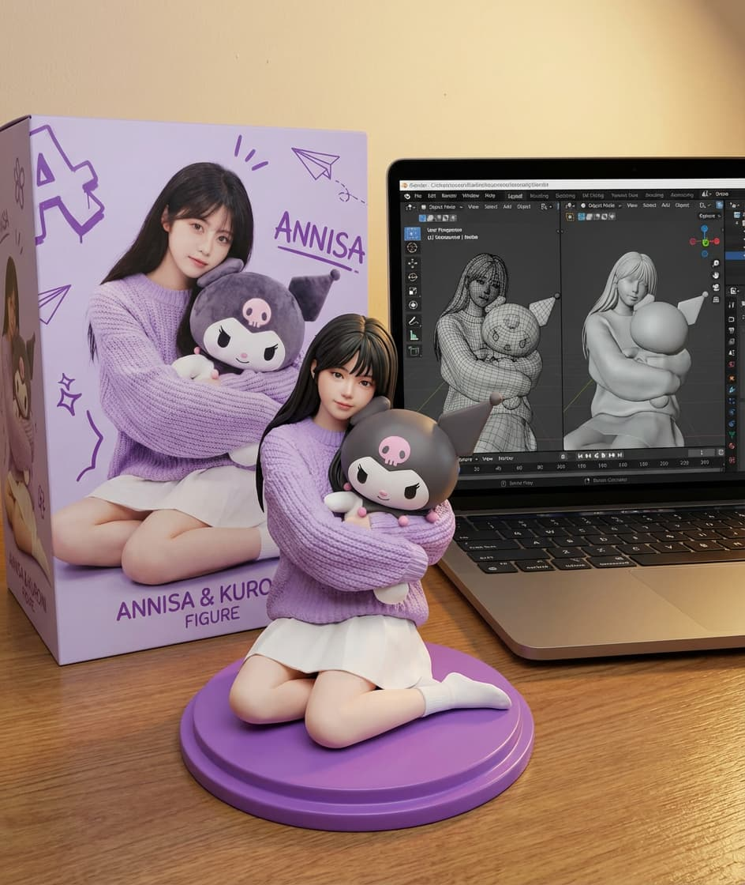

# Awesome-Images-Prompts
适用于 Awesome Gemini Nano-banana Image、即梦、豆包 Seedream 4.0、Hunyuan 3.0、ChatGPT-4o、Grok Image、FLUX、Ideogram、Imagen、Leonardo Ai、Midjourney 等AI生图大模型的提示词

|        | Nano Banana Pro | Nano-banana | 即梦 | 豆包 Seedream 4.0 | Hunyuan 3.0 | ChatGPT-4o |
| ------ | --------------- | ----------- | ---- | ----------------- | ----------- | ---------- |
| 文生图 | ✅               | ✅           | ✅    | ✅                 | ✅           | ✅          |
| 图生图 | ✅               | ✅           | ✅    | ✅                 | ❌           | ✅          |

## 免费使用Nano Banana Pro教程

- [教程：免费领1个月 Gemini 3、Nano Banana Pro和Veo 3会员](https://www.wangdu.site/fuliyouhui/2291.html)
- [12个免费白嫖 Nano Banana Pro 的方法，亲测有用](https://www.wangdu.site/software/ai/2288.html)

## AI生图提示词使用教程

1. [⁤‌‍⁤‌⁢⁣‌‍‬⁢⁤⁡⁤⁡‌⁢‬⁣‬‌‌⁣‍‍‌‌⁤⁣‌⁣‍⁢⁡⁢⁣⁡‌‌豆包 Seedream 4.0 使用指南 - 飞书云文档](https://bytedance.larkoffice.com/docx/XwngdqdhIowfF8xhEA4cwpS2nLb)

## AI生图提示词仓库

### Nano Banana Pro

1. [glidea/banana-prompt-quicker](https://github.com/glidea/banana-prompt-quicker): : 🍌Awesome Prompts; Nano Banana；Banana Pro; Gemini；AI Studio；Prompt Quickly [商店版本 1.3.0，最新版本 1.4.0+，可选择本地安装抢先体验新功能]
2. [YouMind-OpenLab/awesome-nano-banana-pro-prompts](https://github.com/YouMind-OpenLab/awesome-nano-banana-pro-prompts): 🍌 500+ selected Nano Banana Pro prompts with images, multilingual support, and instant gallery preview. Open-source prompt engineering library
3. [🍌Nano Banana - nanobanana, gpt4o, chatgpt 提示词案例库](https://opennana.com/awesome-prompt-gallery/)

### Gemini Nano Banana Pro

1. [ZHO-ZHO-ZHO/ZHO-nano-banana-Creatio](https://github.com/ZHO-ZHO-ZHO/ZHO-nano-banana-Creation)：nano-banana 创意玩法大合集！
2. [PicoTrex/Awesome-Nano-Banana-images](https://github.com/PicoTrex/Awesome-Nano-Banana-images/)：收集了Nano-banana在各个任务场景下生成的令人惊艳的图片和提示词，全方位展示Google在图像生成与编辑的无限可能。希望能帮助你更好地了解 Nano-banana。快一起解锁 Nano-banana 的多图融合与创意编辑力量吧！
3. [JimmyLv/awesome-nano-banana](https://github.com/JimmyLv/awesome-nano-banana): Awesome curated collection of images and prompts generated by gemini-2.5-flash-image (aka Nano Banana) state-of-the-art image generation and editing model. Explore AI generated visuals created with Gemini, showcasing Google’s advanced image generation capabilities.
4. [ZeroLu/awesome-nanobanana-pro](https://github.com/ZeroLu/awesome-nanobanana-pro)🚀 An awesome list of curated Nano Banana pro prompts and examples. Your go-to resource for mastering prompt engineering and exploring the creative potential of the Nano banana pro(Nano banana 2) AI image model.

### GPT-4o

1. [jamez-bondos/awesome-gpt4o-images](https://github.com/jamez-bondos/awesome-gpt4o-images)：一个精选的 GPT-4o 与 gpt-image-1 生成图像与提示词合集。借助 ChatGPT 和 Sora，全面展示 OpenAI 在 AI 图像生成方面的前沿能力，并不断探索创意表达的新可能。
1. [ImgEdify/Awesome-GPT4o-Image-Prompts](https://github.com/ImgEdify/Awesome-GPT4o-Image-Prompts)：GPT4o Prompts Dictionary | Curated Collection of AI Image Generation Prompts

## AI生图提示词展示案例

### 清晰、准确、工程风格的爆炸图

- 使用生图模型：Nano Banana Pro 

```markdown
Exploded isometric teardown diagram of [Put the name of the Object you are exploding]. Separate every component along a clear vertical axis with precise spacing. Render each part with accurate proportions and clean geometry. Include: outer casings, inner frame, mechanical parts, electrical modules, PCB, chips, connectors, buttons, switches, sensors, battery, screws. Use neutral lighting and a plain white background. Add thin uniform annotation lines pointing to each part with short, readable labels placed neatly around the image. No artistic style. No texture exaggeration. No distortion. Only a sharp, professional engineering breakdown similar to a hardware service manual.
```

[作者原贴](https://x.com/beginnersblog1/status/1995464792019202140)

### 多视角主角图

- 使用生图模型：Nano Banana Pro 

```markdown
 分析输入图像的整个构图。识别所有存在的关键主体（无论是单人、群体/情侣、车辆还是特定物体）及其空间关系/互动。 生成一个连贯的 3x3 网格“电影印样（Contact Sheet）”，展示在同一环境中完全是这些主体的 9 个不同镜头。 你必须调整标准的电影镜头类型以适应内容（例如，如果是群体，保持群体在一起；如果是物体，构图包含整个物体）： 第 1 行（建立背景）： 大远景 (ELS)： 主体在广阔的环境中显得很小。 全景 (LS)： 完整的主体或群体从上到下可见（从头到脚 / 从车轮到车顶）。 中远景 (美式镜头/四分之三)： 构图从膝盖以上（针对人物）或 3/4 视角（针对物体）。 第 2 行（核心覆盖）： 4. 中景 (MS)： 构图从腰部以上（或物体的中心核心）。聚焦于互动/动作。 5. 中特写 (MCU)： 构图从胸部以上。主要主体的亲密构图。 6. 特写 (CU)： 紧凑构图于脸部或物体的“正面”。 第 3 行（细节与角度）： 7. 大特写 (ECU)： 强烈聚焦于关键特征（眼睛、手、标志、纹理）的微距细节。 8. 低角度镜头 (仰视/虫眼)： 从地面仰望主体（壮观/英雄感）。 9. 高角度镜头 (俯视/鸟瞰)： 从上方俯瞰主体。 确保严格的一致性：所有 9 个面板中是相同的人物/物体、相同的衣服和相同的光照。景深应逼真地变化（特写镜头中的背景虚化）。 一个包含 9 个面板的专业 3x3 电影故事板网格。 该网格以全面的焦距范围展示输入图像中的特定主体/场景。 顶行： 宽广环境镜头，全视图，3/4 剪辑（膝上景）。 中间行： 腰部以上视图，胸部以上视图，脸部/正面特写。 底行： 微距细节，低角度，高角度。 所有帧均具有照片般逼真的纹理，一致的电影级调色，以及针对所分析的主体或物体特定数量的正确构图。
```

```
Generate a 3x3 cinematic storyboard grid.  
One consistent female model, same outfit, same lighting.  
Theme: French high-end double-breasted trench coat.  
Camera shots sequence:  
Row1: ELS, LS, MLS  
Row2: MS, MCU, CU  
Row3: ECU (details), Low Angle Shot, High Angle Shot  
Ultra-detailed face, natural skin texture, clear pupil highlights.  
Premium fashion editorial tone, clean background, luxury e-commerce style.
```

[作者原贴](https://x.com/LiEvanna85716/status/1995842040731762845)



### Adult Coloring Book Pages（成人填色书页）

#### Cute Halloween Coloring Pages

English Prompt：

```markdown
a black and white coloring page of [insert Halloween scene], black pen outlines, white background, charming, lovable, minimalistic vector line drawing, flat output --no color --ar 49:64 --s 47 --v 5.2 --q 1
```

### 日系朦胧感美女

[作者原贴](https://x.com/MANISH1027512/status/1978041705623343437)

English Prompt：

```markdown
a dreamy intimate portrait of a beautiful realistic asian woman lying under a blanket, soft natural light, cozy warm bedroom, cinematic film grain, 35mm film aesthetic, shallow depth of field, soft focus, delicate skin texture, natural makeup, slightly messy hair, Fujifilm Pro 400H look, pastel warm tones, realistic lighting, subtle haze, gentle atmosphere, by Petra Collins and Ren Hang --ar 3:4 --v7 --style raw
```


###  梦幻般美女胶片照片

[作者原贴](https://x.com/MANISH1027512/status/1981332633444339960)

English Prompt：

```
a dreamy top-down film photograph of a young beautiful East Asian woman lying on the floor surrounded by colorful anime magazines; relaxed gaze at camera, soft lips slightly parted; short fluffy dark hair with bangs; wearing a loose white short-sleeve blouse with lace trim and pale shorts, natural makeup with soft pink lips and subtle blush precise leg pose: pelvis slightly rotated toward camera; the near leg lifted and bent at the knee about 120 degrees, thigh pointing toward the camera with strong foreshortening, calf directed toward the bottom edge, ankle gently plantar-flexed, semi-transparent ankle sock visible; the far leg extended diagonally outward captured with a fisheye lens, producing ultra-wide barrel distortion, curved perspective lines, and central magnification; edges softly blurred with a dark circular vignette, creating a tunnel vision effect and nostalgic dreamy mood rainbow reflections from glossy magazines, warm ambient lighting, analog film grain texture, Japanese retro aesthetic
```

中文提示词：

```
一张梦幻般的自上而下胶片照片，照片中一位年轻美丽的东亚女性躺在地板上，周围是色彩缤纷的动漫杂志；她放松地注视着镜头，柔软的嘴唇微微张开；蓬松的深色短发，有刘海；她身穿宽松的白色短袖衬衫，饰有蕾丝花边，配以浅色短裤，化着自然妆容，嘴唇上涂着柔和的粉红色，并带有淡淡的腮红；精确的腿部姿势：骨盆略微向镜头旋转；近腿抬起，膝盖弯曲约 120 度，大腿指向镜头，透视感很强，小腿朝向底部边缘，脚踝轻轻跖屈，半透明的踝袜清晰可见；远处的腿向外斜伸展，用鱼眼镜头拍摄，产生超广角桶形失真、弯曲的透视线和中心放大；边缘用深色圆形晕影柔和模糊，营造出隧道视觉效果和怀旧梦幻般的氛围，光泽杂志的彩虹反射，温暖的环境照明，模拟胶片颗粒纹理，日本复古美学
```



### 超写实哥特式兔子工作室肖像

```
"prompt_title": "Hyperrealistic Gothic Bunny Studio Portrait",
"image_description": "An ultra-photorealistic, high-resolution studio portrait of a female subject in a gothic-inspired bunny costume, featuring intricate lace ears, a structured corset, and delicate hosiery. The subject is posed on the floor, exuding an alluring and sophisticated aura under precise studio lighting.",
"subject": {
"gender": "female",
"appearance": "Young adult with a flawless, luminous complexion. **Extreme micro-detail rendering on skin, showing subtle pores, fine vellus hairs, accurate light interaction (sub-surface scattering), and realistic skin texture.**",
"facial_features": "Smooth, clear skin. Her eyes are large, dark, and captivating, looking directly into the camera with a **confident and slightly seductive expression**. Lips are full, with a matte red or deep berry lipstick that shows micro-creases. Defined eyebrows and subtle contouring.",
"hair_style": "Long, flowing, wavy black hair, cascading over her shoulders and back. **Hair must show individual strands, realistic volume, high-gloss reflections, and subtle flyaways.**",
"makeup": "Dramatic and precise. Sharp, winged black eyeliner, full, dark eyelashes (possibly individual lash extensions), subtle glitter or shimmer on eyelids. Contoured cheeks. Flawless foundation and blush.",
"attire": {
"headwear": "Intricate **black lace bunny ears headband**. The lace should have visible patterns, delicate wire structure, and possibly small faux floral or ribbon accents. Realistic light interaction with the lace.",
"neck_accessories": "A simple, fitted black velvet or leather choker necklace.",
"main_outfit": "A highly detailed **black strapless corset dress or top and skirt ensemble**. The corset should be structured, showing **visible boning and lacing details** (possibly satin or leather laces). Fabric should be a mix of matte black leather/faux leather and textured, ruffled black tulle or chiffon for the skirt. **Emphasis on realistic fabric folds, textures, and subtle sheen.**",
"hosiery": "Sheer black thigh-high stockings with a delicate lace top band, clearly visible on her upper thigh. **Stockings must show realistic transparency and fabric stretch over skin.**",
"footwear": "Black pointed-toe high heels with ankle straps. The material should be a realistic matte or patent leather, showing accurate reflections and shoe construction."
}
},
"pose": {
"description": "The subject is kneeling on a flat, light-colored studio floor, leaning slightly forward. Her left hand is placed on the floor beside her left knee, fingers slightly spread. Her right arm is gently resting on her right thigh. Her body is slightly twisted, creating an alluring silhouette. **Exact replication of the confident and poised pose.**",
"camera_angle": "Medium shot, eye-level angle, slightly looking down at the subject. The camera is positioned to capture her full body from the mid-thigh up, with enough space around her to establish the studio environment.",
"composition": "Centered composition, vertical orientation. The subject fills approximately 70-80% of the frame, with subtle negative space around her. **Sharp focus on the subject, with a very shallow depth of field creating a soft bokeh in the background.**"
},
"setting": {
"location": "Professional indoor photo studio.",
"background_elements": "Seamless, plain light gray or off-white backdrop, extending from the floor to the wall, creating a clean, infinite background. **Subtle, soft gradient in the background due to lighting falloff.**"
},
"lighting_and_atmosphere": {
"key_light_source": "Softbox or parabolic diffuser from the front-left, creating soft, even illumination with subtle directional shadows to define contours.",
"fill_light": "Subtle fill light from the front-right to reduce harsh shadows on the right side of her face and body.",
"back_light": "A subtle hair light or rim light from the rear-right to create separation from the background and add definition to her hair and shoulders.",
"highlights_shadows": "Soft, creamy highlights on skin, hair, and corset material. Deep but soft shadows defining facial structure and body contours. **Accurate light falloff and realistic specular reflections on materials.**",
"photographic_realism": "Extreme micro-detail, sub-surface scattering on skin, realistic fabric textures (lace, leather, tulle), **cinematic studio lighting**, crisp focus on eyes, perfect white balance, neutral color grading, **ultra-realistic material rendering (PBR - Physically Based Rendering).**"
},
"style_and_camera": {
"photographic_style": "High-fashion portraiture, hyperrealistic studio photography, fine art glamour.",
"camera_type": "High-end full-frame mirrorless camera (e.g., Sony A1, Canon R5) with a fast prime lens (e.g., 50mm f/1.2 or 85mm f/1.4).",
"camera_values": "ISO 100, f/1.8, 1/160 sec. **These values contribute to shallow depth of field, sharp detail, and clean image quality.**",
"resolution_quality": "8K resolution, ultra-photorealistic, extreme detail on all elements. **Masterpiece quality render, production quality image.**"
},
"negative_prompt_suggestions": [
"blurry", "low resolution", "deformed", "harsh lighting", "flat background", "bad anatomy",
"cartoon", "illustration", "painting", "text", "watermark", "oversaturated", "poor composition",
"unrealistic skin", "plastic texture", "missing details"
]
}
```

### 3D Twitter Profile Card（3D 推特个人资料卡片）


[shirish](https://x.com/shiri_shh/status/1984196161784422790)

1. 截取您的 Twitter 个人资料屏幕截图。 

2. 打开 ChatGPT 

3. 粘贴您的屏幕截图和以下提示词：

   ```markdown
   Create a hyper-realistic 3D render of a transparent twitter profile card, designed like a futuristic glass ID badge held gently between two fingers. The card should be rectangular with rounded corners, made of clear glossy glass or acrylic, with glowing neon edges in pink, purple, and orange gradient inspired by the twitter color palette. Display the following profile information on the card using modern, minimal sans-serif typography.
   ```

   ```markdown
   制作一张超逼真的透明推特个人资料卡的3D渲染图，设计灵感源自未来主义的玻璃身份识别卡，可轻柔地夹在两指之间。卡片应为圆角矩形，材质为透明光面玻璃或亚克力，边缘带有粉色、紫色和橙色渐变的霓虹灯效果，灵感来自推特的配色方案。使用现代简约的无衬线字体在卡片上展示以下个人资料信息。
   ```

### 3D chibli style kawaii sticker（3D 千纸鹤风格卡哇伊贴纸）

[Shreya Yadav 作者原贴](https://x.com/ShreyaYadav___/status/1985738257708302430)

- 使用 AI 模型：ChatGPT

```markdown
Create a 3D kawaii 10:16 canvas featuring nine chibi-style stickers in various outfits, poses, and expressions. Use the attached image for reference. Each sticker has a white border and includes a speech bubble with phrases like "Goodmorning", "Lunch kana", "Huh", "Hugs", "Thank you", "Goodnight", "You're the best" "miss you" "mwah 😙" "good job" and "Ingat ka". Set on a soft white-to-pastel blue gradient background for a fun, positive vibe.
```


### 3D cartoon girl

- 使用 AI 模型：Gemini Nano Banana

```markdown
cheerful 3D cartoon girl with long dark hair, white flower hair clip, expressive brown eyes, soft rounded features; wearing a mix of cute outfits (white off-shoulder top, yellow sweater, purple tee, green dress, blue pajamas, coral shirt, pink blazer); each pose conveys emotions like waving, hugging, clapping, sleeping, and giving a thumbs up
Setting: bright neutral background in a 3×3 grid sticker layout, each labeled with phrases — “Goodmorning,” “Lunch kana,” “Huh?,” “Hugs,” “Thank you,” “Goodnight,” “You’re the best,” “miss you,” and “good job”; with an elegant overlay at the top center reading “Thank You 900 Followers” in a friendly, modern font
Lighting: soft diffuse daylight, balanced exposure emphasizing 3D shading and gloss
Camera: straight-on, symmetrical framing, close-up shot for detail clarity
Style: kawaii 3D emoji-sticker illustration, modern gratitude aesthetic
Color Palette: warm and pastel tones — cream, blush pink, sage green, sky blue, peach, ivory
Quality: ultra-detailed, high-resolution, photorealistic 3D render
Reference: uploaded face
Negative Prompt: distorted text, blur, watermark, overexposure, bad anatomy
```


### Raw photoreal high fidelity Gril

[作者原贴](https://x.com/IamEmily2050/status/1985682978182480251)

- 使用 AI 模型：Google Gemini Flash 2.5 Nano banana 

```markdown
{
    "style_mode": "raw_photoreal_high_fidelity",
    "look": "K-Pop idol aesthetic, flawless complexion, high-resolution digital photography, trendy",
    "camera": {
      "vantage": "slightly high angle (selfie perspective), direct address",
      "framing": "extreme close-up (ECU), tight framing on the face and shoulders",
      "lens_behavior": "portrait lens (e.g., 85mm prime), extremely shallow depth of field (DoF), sharp focus on the eyes",
      "sensor_quality": "high fidelity, no digital noise"
    }
  },
  "scene": {
    "environment": {
      "setting": "indoor studio or simple interior",
      "lighting": "soft, even beauty lighting (e.g., large softbox or beauty dish), minimizing shadows, creating clear catchlights in the eyes, emphasizing glossy highlights"
    },
    "subject": {
      "description": "young East Asian female, K-Pop idol styling",
      "hair": "long, dark brown, wavy, glossy finish",
      "expression": {
        "mood": "playful, confident, slightly sultry",
        "action": "looking directly into the lens, mouth slightly open, tongue slightly sticking out over the lower lip"
      },
      "makeup": {
        "style": "contemporary K-beauty trends",
        "complexion": "flawless, 'glass skin' effect, dewy/glossy finish, realistic micro-texture",
        "cheeks": "rosy blush, high application",
        "lips": "glossy, pink tint"
      },
      "attire": {
        "top": "grey pinstriped halter top, structured design",
        "details": "white contrasting collar lapel with silver snap buttons and circular metal hardware"
      },
      "accessories": {
        "hair_clip": "decorative silver/rhinestone clip on her left side",
        "earrings": "dangling silver earrings (heart motif)"
      }
    },
    "background": {
      "description": "plain, neutral grey or white wall, blurred (bokeh)"
    }
  },
  "aesthetic_controls": {
    "render_intent": "high-quality digital photograph suitable for promotional material or social media",
    "material_fidelity": [
      "realistic skin micro-texture (pores, gloss, makeup interaction)",
      "individual hair strand detail",
      "fabric texture of the pinstripe material",
      "metallic shine of accessories"
    ],
    "color_grade": {
      "overall": "neutral, slightly warm, vibrant skin tones, high clarity",
      "contrast": "balanced"
    }
  },
  "negative_prompt": {
    "forbidden_elements": ["skin imperfections", "blemishes", "wrinkles", "harsh shadows", "textured/matte skin", "dry lips", "outdoor setting", "distorted features", "motion blur", "digital artifacts"],
    "forbidden_style": ["anime", "painting", "illustration", "CGI render", "low resolution", "gritty realism", "vintage photography", "uncanny valley", "overly airbrushed/plastic skin"]
  }
}
```


### 年轻女性单人半身近景肖像

[作者原贴](https://x.com/qisi_ai/status/1999375955622789516)

```markdown
一、画面主题
1 人物类型：年轻女性单人半身近景肖像
2 姿态视角：侧身回眸，肩背朝向镜头外侧，头部微转看向镜头
3 取景范围：头部到上背部与肩部，人物占画面主体，留少量背景空间
4 画面比例：竖幅，人物略偏左，眼睛位于上三分线附近

二、五官与表情
1 表情气质：清冷克制，略带疏离感，不露齿
2 眼部特征：大眼比例，睫毛清晰，眼神聚焦镜头，眼下轻微卧蚕与柔和阴影
3 唇部特征：饱满水润，边缘柔和，带明显高光与果冻质感
4 肤感特征：极致细腻平滑，毛孔弱化，整体偏白净通透

三、妆容风格
1 底妆：高遮瑕与柔雾磨皮结合，局部保留自然高光
2 腮红：从颧骨到眼下扩散的粉色晕染，轻薄但可见
3 眼妆：细致上眼线与自然加深眼尾，浅棕灰系过渡，整体干净
4 唇妆：粉豆沙到浅玫瑰的渐变，叠加强光泽感

四、发型与配饰
1 发型：深色直发，低马尾或低位扎发，头顶蓬松自然
2 刘海：中分，细碎发丝垂落两侧贴近脸颊
3 眼镜：金属细框透明镜片，椭圆偏方的镜框，镜腿有金属装饰
4 耳饰：耳廓位置小型耳钉，低调点缀

五、服装与肌肤细节
1 服装：红色细肩带，露背设计，肩带在画面右侧清晰可见
2 皮肤光泽：肩背处有柔和反光，呈现细腻奶油肌质感

六、光线与影调
1 主光方向：左前上方柔光，覆盖面大，阴影非常软
2 补光：正前方弱补光，压低对比度，使面部几乎无硬阴影
3 高光控制：鼻梁、上唇、下唇与眼镜边缘有小面积亮点高光
4 整体影调：低对比、柔雾感、层次细腻，暗部不死黑

七、背景与环境
1 背景：纯净单色浅粉灰渐变墙面，无纹理无杂物
2 景深：背景强虚化或本身极简，使人物轮廓更突出
3 氛围：干净、静谧、带轻微甜冷感

八、镜头与画面质感模拟
1 焦距感觉：中长焦近景压缩感，脸部比例自然不夸张
2 景深表现：眼睛清晰，耳后与背景明显虚化
3 清晰度：五官边缘清晰但不过锐，整体偏柔
4 噪点：几乎无颗粒，呈现干净的商业人像质感

九、后期处理要点
1 磨皮：强但自然，保留少量面部结构与阴影过渡
2 色彩：整体偏冷白肤色，腮红与唇色偏粉，红肩带饱和但不过分
3 光晕：轻微柔光扩散效果，让高光更圆润
4 统一性：控制对比与锐度，保持通透、柔和、清洁的画面一致性

十、反向提示词
1 画面问题：过度锐化、强对比、硬阴影、背景杂乱、噪点颗粒明显
2 人物问题：夸张表情、露齿大笑、皮肤粗糙毛孔明显、油光满面、脸部畸变
3 风格偏离：浓重舞台妆、强烈复古色偏、复杂服饰、夸张饰品、强烈环境光源干扰
```



### 圣诞写真

[作者原贴](https://x.com/LiEvanna85716/status/2000530737842557269)

```markdown
Professional studio portrait photography, Christmas winter theme, white studio background.  Young Asian woman, age 20-23, beautiful delicate features: - Large expressive eyes with double eyelids - Elegant facial features, high cheekbones - Natural makeup: soft pink blush, natural lip color - Shoulder-length dark brown hair - Fair porcelain skin with realistic texture (visible pores)  Outfit: - Bright red cable knit beanie - Bright red chunky wool scarf - Black wool coat  Studio setup: Pure white seamless background, professional soft lighting, snowflakes falling on hair/beanie/scarf  Technical: 85mm lens, f/1.8-2.8, natural soft studio lighting, realistic skin texture, high-end fashion portrait quality  Mood: Natural, warm, gentle expression, serene and contemplative
```


### 修复老照片

[作者原贴](https://x.com/lxfater/status/2000792144588804243)

```
 {  "task": "portrait_restoration",  "language": "zh-CN",  "prompt": {  "subject": { "type": "human_portrait", "identity_fidelity": "match_uploaded_face_100_percent", "no_facial_modification": true, "expression": "natural", "eye_detail": "sharp_clear", "skin_texture": "ultra_realistic", "hair_detail": "natural_individual_strands", "fabric_detail": "rich_high_frequency_detail" }, "lighting": { "exposure": "bright_clear", "style": "soft_studio_light", "brightness_balance": "even", "specular_highlights": "natural_on_face_and_eyes", "shadow_transition": "smooth_gradual" }, "image_quality": { "resolution": "8k", "clarity": "high", "noise": "clean_low", "artifacts": "none", "over_smoothing": "none" }, "optics": { "camera_style": "full_frame_dslr", "lens": "85mm", "aperture": "f/1.8", "depth_of_field": "soft_shallow", "bokeh": "smooth_natural" }, "background": { "style": "clean_elegant", "distraction_free": true, "tone": "neutral" }, "color_grading": { "style": "cinematic", "saturation": "rich_but_natural", "white_balance": "accurate", "skin_tone": "natural_true_to_subject" }, "style_constraints": { "no_cartoon": true, "no_beauty_filter": true, "no_plastic_skin": true, "no_face_reshaping": true, "no_ai_face_swap": true } },  "negative_prompt": [  "cartoon", "anime", "cgi", "painterly", "plastic skin", "over-smoothing", "over-sharpening halos", "heavy skin retouching", "face reshaping", "identity drift", "face swap", "beauty filter", "uncanny", "washed out", "color cast", "blown highlights", "crushed shadows", "banding", "jpeg artifacts", "extra fingers", "deformed eyes", "asymmetrical face", "warped features" ],  "parameters": {  "fidelity_priority": "identity", "detail_priority": "eyes_skin_hair_fabric", "realism_strength": 0.95, "sharpening": "micro_contrast_only", "skin_retention": "keep_pores_and_microtexture", "recommended_denoise": "low_to_medium" }  }
```

### 图片变手办提示词

```markdown
turn this photo into a character figure. Behind it, place a box with the character’s image printed on it, and a computer showing the Blender modeling process on its screen. In front of the box, add a round plastic base with the character figure standing on it. set the scene indoors if possible
```



## 圣诞节相关提示词

- Christmas Prompts for Gemini

- Gemini AI Christmas Photo Editing Prompts to Create Festive

### Glamorous Christmas Side Portrait

魅力圣诞侧脸照

```markdown
Create an ultra-detailed 45-degree side portrait of a woman leaning casually against a tree, keeping her face exactly the same as the reference image. She wears a golden sequinned cap-sleeve top tucked neatly into a high-waisted, rich red flowing palazzo, paired with sleek golden heels. A cute finger gesture is subtly directed toward the camera, adding charm and elegance. Star-shaped studs and a star locket softly glow under warm chandelier lighting. The scene is set in a rich, glamorous Christmas ambience with cinematic warmth and festive luxury.
```

```
创作一张细节丰富的45度侧脸肖像，描绘一位女士随意地倚靠在树上，面部特征与参考图片完全一致。她身穿金色亮片短袖上衣，下摆整齐地塞进一条高腰的深红色阔腿裤中，脚踩一双精致的金色高跟鞋。她俏皮地指向镜头，手指轻轻指向前方，增添了几分魅力和优雅。星形耳钉和星形吊坠在温暖的水晶吊灯下散发出柔和的光芒。整个场景营造出浓郁而迷人的圣诞氛围，充满电影般的温暖和节日的奢华感。
```

### Elegant Christmas Gift Portrait

优雅的圣诞礼物肖像

```markdown
Create a festive outdoor Christmas portrait of a woman standing beside a large Santa, keeping her face exactly the same as the reference image. She wears a full-length golden sequin collared dress with a graceful calf-length side slit. Her rolled hair cascades softly over one shoulder as she smiles warmly while holding a gift. The scene features a decorated Christmas tree with ornaments, wreaths, and glowing fairy lights. White rabbits sit playfully around stacked gift boxes, enhancing the magical holiday atmosphere.
```

```markdown
创作一幅充满节日气氛的户外圣诞肖像画，画中一位女士站在一个巨大的圣诞老人旁边，面部特征与参考图片完全一致。她身穿一件金色亮片长裙，裙摆侧边开衩至小腿，优雅迷人。她卷曲的秀发柔顺地披散在一侧肩头，脸上带着温暖的笑容，手中拿着一份礼物。画面中还有一棵装饰精美的圣诞树，上面挂满了饰品、花环和闪烁的彩灯。几只白兔在堆叠的礼盒周围嬉戏玩耍，更添节日的梦幻氛围。
```

### Cinematic Christmas Living Room Portrait

优雅的圣诞礼物肖像

```markdown
Create an ultra-realistic, cinematic full-body indoor portrait of a woman standing casually, keeping her face exactly the same as the reference image. She wears a deep red elegant full-length dress with short puff sleeves, a thin golden waist belt, and sleek golden heels. Her expression is cheerful with a gentle, confident smile. The setting is a cozy Christmas-themed living room with a decorated tree, wall wreath, fairy lights, and a beige sofa with festive cushions. Warm golden ambient lighting, shallow depth of field, cinematic bokeh, 4K ultra-detail, and realistic skin texture complete the festive holiday mood.
```

```markdown
创作一幅充满节日气氛的户外圣诞肖像画，画中一位女士站在一个巨大的圣诞老人旁边，面部特征与参考图片完全一致。她身穿一件金色亮片长裙，裙摆侧边开衩至小腿，优雅迷人。她卷曲的秀发柔顺地披散在一侧肩头，脸上带着温暖的笑容，手中拿着一份礼物。画面中还有一棵装饰精美的圣诞树，上面挂满了饰品、花环和闪烁的彩灯。几只白兔在堆叠的礼盒周围嬉戏玩耍，更添节日的梦幻氛围。
```

### Golden Christmas Celebration Portrait

电影般的圣诞客厅肖像

```
A photorealistic full-body shot of a smiling young woman with long dark hair in a pony tail, wearing a shimmering gold knee-length dress and gold heels, standing in front of a beautifully lit Christmas tree. She is holding a small white plate with a slice of cake and eating a bite, looking directly at the camera with joy. The background features warm, glowing fairy lights, gold and red ornaments on the tree, and wrapped red gift boxes on the floor, creating a cozy and luxurious holiday atmosphere. Don't change the face, make sure the face is the same.
```

```markdown
创作一张超逼真、电影级的室内全身肖像，描绘一位姿态自然的女性，面部特征与参考图像完全一致。她身着深红色优雅长裙，短款泡泡袖，搭配金色细腰带和金色高跟鞋。她神情愉悦，笑容温柔自信。场景设定在一个温馨的圣诞主题客厅，装饰着圣诞树、花环、彩灯和米色沙发，沙发上摆放着节日主题的靠垫。温暖的金色环境光、浅景深、电影级散景、4K超高清细节和逼真的皮肤纹理，共同营造出浓厚的节日氛围。
```

### Elegant Christmas Indoor Portrait

金色圣诞庆典肖像

```
A photorealistic full-body shot of a smiling young woman with long wavy dark hair, wearing an elegant maroon maxi dress with short puff sleeves and a thin gold belt, paired with gold heels. She stands confidently with one hand on her hip in a cozy living room decorated for Christmas. To her left is a glowing Christmas tree with ornaments and wrapped gifts, and behind her is a beige sofa with festive pillows and a wall adorned with string lights and a wreath. The lighting is warm and inviting, capturing a cheerful holiday atmosphere. Don't change the face, make sure the face is the same.
```

```markdown
一张逼真的全身照，照片中一位面带微笑的年轻女子，长长的黑发扎成马尾辫，身穿闪亮的金色及膝连衣裙和金色高跟鞋，站在一棵灯光璀璨的圣诞树前。她手捧一小碟白色蛋糕，正津津有味地吃着，脸上洋溢着喜悦，直视着镜头。背景中点缀着温暖闪烁的彩灯，圣诞树上挂满了金色和红色的装饰品，地板上散落着包装精美的红色礼盒，营造出温馨奢华的节日氛围。请勿更改面部，务必确保面部特征保持一致。
```

### Cinematic Christmas Living Room Portrait

电影般的圣诞客厅肖像

```markdown
Create an ultra-realistic, cinematic full-body indoor portrait of a woman standing casually, keeping her face exactly the same as the reference image. She wears a deep red elegant full-length dress with short puff sleeves, a thin golden waist belt, and sleek golden heels. Her expression is cheerful with a gentle, confident smile. The setting is a cozy Christmas-themed living room with a decorated tree, wall wreath, fairy lights, and a beige sofa with festive cushions. Warm golden ambient lighting, shallow depth of field, cinematic bokeh, 4K ultra-detail, and realistic skin texture complete the festive holiday mood.
```

```markdown
创作一张超逼真、电影级的室内全身肖像，描绘一位姿态自然的女性，面部特征与参考图像完全一致。她身着深红色优雅长裙，短款泡泡袖，搭配金色细腰带和金色高跟鞋。她神情愉悦，笑容温柔自信。场景设定在一个温馨的圣诞主题客厅，装饰着圣诞树、花环、彩灯和米色沙发，沙发上摆放着节日主题的靠垫。温暖的金色环境光、浅景深、电影级散景、4K超高清细节和逼真的皮肤纹理，共同营造出浓厚的节日氛围。
```

### Futuristic Santa Sleigh Portrait

未来主义圣诞老人雪橇肖像

```markdown
Create an ultra-realistic, humorous Christmas scene using the exact face from the reference image. The subject sits in a high-tech futuristic sleigh beside Santa Claus, designed with chrome metal and glowing LED accents. A snowy sky surrounds the scene with dynamic motion blur for cinematic energy. Digital, glowing reindeers fly alongside the sleigh, enhancing the sci-fi holiday vibe. The mood is joyful, playful, and modern with a strong tech-Christmas fusion.
```

```markdown
使用参考图像中的精确面部特征，创作一幅超逼真、幽默的圣诞场景。人物坐在高科技未来主义雪橇上，旁边是圣诞老人，雪橇采用镀铬金属和闪亮的LED装饰。雪景笼罩着整个场景，动态模糊效果营造出电影般的动感。数字发光的驯鹿在雪橇旁飞翔，增强了科幻节日氛围。整体氛围欢乐、轻松、现代，完美融合了科技与圣诞元素。
```


### Cinematic North Pole Identity Portrait

电影化的北极身份肖像

- 需要参考图

```markdown
Create a warmly lit winter scene with a subtle summer-like mood, using the reference image as a strict identity guide and preserving the face 100% exactly. The subject stands slightly forward in heavy winter clothing and gloves, with unchanged skin tone, texture, facial hair, and hairstyle. A cheerful Santa Claus in a classic red velvet suit leans in from the left, while a reindeer with a glossy bright red (non-glowing) nose and leather harness looks at the camera from the right. The background features a vast snowy North Pole with ice formations, festive wooden workshops, and decorated Christmas trees. Natural cold winter daylight creates a cinematic, realistic atmosphere with no alterations or inventions.
```

```markdown
以参考图片为严格的身份参考，100%还原人物面部，创作一幅光线温暖、略带夏日气息的冬日场景。人物身着厚重的冬装和手套，略微前倾，肤色、纹理、胡须和发型均保持不变。一位身着经典红色天鹅绒套装、笑容可掬的圣诞老人从左侧探出头来，而一只鼻子鲜红（不发光）且佩戴皮质挽具的驯鹿则从右侧望向镜头。背景是广袤无垠的北极雪景，点缀着冰雪、节日气氛浓厚的木制作坊和装饰精美的圣诞树。自然寒冷的冬日日光营造出电影般的真实氛围，无需任何修改或虚构。
```

### Luxury Santa Forest Portrait

奢华圣塔森林肖像

- 需要参考图

```
Create an ultra-realistic cinematic Christmas portrait inspired by the reference image, with no text or logos, preserving the man’s face exactly as uploaded. He stands centered in a snowy winter forest at night, wearing a classic red Santa-style jacket with white fur trim, white gloves, and a wide belt, no Santa hat, natural visible hair. He carries a large green sack over his shoulder filled with neatly wrapped red, green, and gold gifts with bows. Soft snowfall surrounds him as snow-covered trees fade into a cinematic background with shallow depth of field. Cool blue winter tones contrast with warm festive colors, enhanced by soft lighting, subtle rim light, and natural skin texture for premium editorial realism.
```

```markdown
根据参考图片，创作一幅超逼真的电影级圣诞肖像，画面中不得包含任何文字或标识，并完整保留上传图片中人物的面部特征。他身着经典的红色圣诞老人式外套，饰有白色毛边，戴着白色手套和宽腰带，未戴圣诞帽，头发自然可见。他肩上挎着一个绿色大袋子，里面装满了包装精美的红色、绿色和金色礼物，并系着蝴蝶结。轻柔的雪花环绕着他，白雪皑皑的树木渐渐融入浅景深的电影背景中。冷冽的蓝色调与温暖的节日色彩形成对比，柔和的光线、微妙的轮廓光和自然的皮肤纹理，共同营造出高级的编辑级真实感。
```

### Magical Snow Globe Portrait

神奇雪球肖像

```markdown
Create a warm, festive portrait of a smiling man holding a large snow globe, keeping his face exactly the same as the reference image. Inside the globe is a miniature winter scene with a cozy wooden house glowing warmly, a decorated tree, and gentle falling snow. He wears a red knitted beanie with a pom-pom, a white sweater, and red fingerless gloves. The background shows a snowy outdoor setting with soft bokeh holiday lights and blurred trees. The mood is magical, cozy, and cinematic with rich holiday warmth.
```

```markdown
创作一幅温馨喜庆的肖像画，画中一位面带微笑的男士手捧一个大型雪球，面部表情需与参考图片完全一致。雪球内是一个微缩的冬季场景：一栋温暖的木屋散发着柔和的光芒，一棵装饰精美的圣诞树，雪花轻柔飘落。他戴着一顶带绒球的红色针织帽，身穿白色毛衣和红色露指手套。背景是白雪皑皑的户外景色，点缀着柔和的节日彩灯和模糊的树木。整幅画作充满魔幻、温馨和电影般的质感，洋溢着浓郁的节日氛围。
```

### Elegant Forest Fantasy

```markdown
A solo holiday portrait in a red velvet dress and gold beret set in a softly blurred snowy forest with fairy lights - festive, elegant, dreamy.
```

